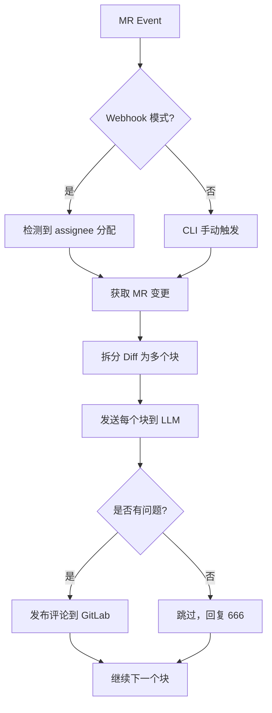

# AI Code Reviewer

[](https://www.npmjs.com/package/@kiol/ai-code-reviewer)
[](https://opensource.org/licenses/MIT)

> 🤖 基于 AI 的 GitLab Merge Request 自动化代码审查工具

`@kiol/ai-code-reviewer` 是一款智能代码审查小工具，它集成到 GitLab 工作流中，自动分析 Merge Request (MR) 的代码变更并提供专业审查意见。支持私有化部署和多种大语言模型提供商。既支持集成到CI/CD工作流调用，也支持gitlab Webhook事件触发。


## ✨ 特点

- 🤖 **AI 驱动**：调用 OpenAI 兼容 API（GPT、Claude、通义千问等）进行智能代码审查
- 🛠️ **GitLab 原生集成**：支持私有化部署的 GitLab，直接评论到 MR 对应行号
- 🌍 **多模型支持**：兼容任何 OpenAI API 格式的模型提供商
- 🔑 **负载均衡**：支持配置多个 API Key，自动轮询分发请求
- ⏱️ **智能重试**：API 速率限制时自动等待并重试
- 💬 **精准评论**：审查结果以评论形式追加到具体代码行
- 🎯 **按需触发**：Webhook 模式下仅在实际分配 reviewer 时触发审查
- 🔧 **灵活配置**：支持 TOML/JSON 配置文件和命令行参数

## 📦 安装

### npm / pnpm / yarn

```bash
# 使用 npm
npm install -g @kiol/ai-code-reviewer

# 或使用 pnpm
pnpm add -g @kiol/ai-code-reviewer

# 或使用 yarn
yarn global add @kiol/ai-code-reviewer
```

### 从源码构建

```bash
git clone https://github.com/jiayp/ai-code-reviewer.git
cd ai-code-reviewer
pnpm install
pnpm build
npm link
```

## 🚀 快速开始

### 1. 配置

创建配置文件 `ai-code-reviewer.config.toml`：

```toml
[gitlab]
accessToken = "your-gitlab-personal-access-token"
apiUrl = "https://gitlab.example.com/api/v4"  # GitLab API 地址
projectId = 12345                              # GitLab 项目 ID
mergeRequestId = ""                            # MR IID（CLI 模式使用）

[openai]
accessToken = "sk-your-openai-api-key"         # OpenAI 兼容 API Key
apiUrl = "https://api.openai.com/v1"           # API 地址
model = "gpt-4-turbo"                          # 模型名称
temperature = 0                                # 创造性（0=确定，1=创意）
organizationId = ""                            # Organization ID（可选）

[webhook]
port = 8080                                    # Web 服务端口
secretToken = "your-secret-token"              # Webhook 验证密钥
```

**注意**：敏感信息如 `accessToken` 和 `secretToken` 应通过环境变量或 CI/CD secrets 注入，不要硬编码在配置文件中。

### 2. 两种使用模式

#### 模式 A：Webhook 监听模式（推荐用于生产环境）

启动 Web 服务，接收 GitLab MR 事件并自动触发代码审查：

```bash
# 基本启动（使用配置文件中的设置）
ai-code-reviewer web

# 指定端口和其他覆盖配置
ai-code-reviewer web -w 9000 -t "$GITLAB_TOKEN" -a "$OPENAI_KEY"

# 在后台运行（Linux/macOS）
nohup ai-code-reviewer web > webhook.log 2>&1 &
```

**GitLab Webhook 配置步骤：**
1. 进入 GitLab 项目 → Settings → Webhooks
2. URL: `http://your-server:8080/webhooks/merge-request`（替换为你的服务器地址）
3. Secret Token: 填入配置文件中的 `webhook.secretToken`
4. 触发器：勾选 **Merge request events**

当 MR 被分配给某人时，Web 服务会自动触发代码审查并在评论中给出建议。

#### 模式 B：CLI 一次性审查（适合 CI/CD）

手动或脚本方式对特定 MR 进行审查：

```bash
# 使用配置文件
ai-code-reviewer review -p 12345 -r 8

# 命令行覆盖所有配置
ai-code-reviewer review \
  -t "your-gitlab-token" \
  -a "your-openai-key" \
  -p 12345 \
  -r 8 \
  --model gpt-4-turbo
```

### 3. 在 CI/CD 中使用

#### GitLab CI（CLI 模式）

在项目根目录创建 `.gitlab-ci.yml`：

```yaml
stages:
  - code-review

CodeReview:
  stage: code-review
  image: node:18-alpine
  before_script:
    - npm install -g @kiol/ai-code-reviewer
  script:
    - ai-code-reviewer review \
        --config .ai-code-reviewer.config.toml \
        -p "$CI_MERGE_REQUEST_PROJECT_ID" \
        -r "$CI_MERGE_REQUEST_IID"
  only:
    variables:
      - $CI_PIPELINE_SOURCE == "merge_request_event"
```

## 📋 配置参考

### TOML 配置格式（推荐）

详细配置示例见 [`ai-code-reviewer.config.example.toml`](ai-code-reviewer.config.example.toml)。

### JSON 配置格式

```json
{
  "gitlab": {
    "accessToken": "your-gitlab-token",
    "apiUrl": "https://gitlab.example.com/api/v4",
    "projectId": 12345,
    "mergeRequestId": ""
  },
  "openai": {
    "accessToken": "sk-your-api-key",
    "apiUrl": "https://api.openai.com/v1",
    "model": "gpt-4-turbo",
    "temperature": 0,
    "organizationId": ""
  },
  "webhook": {
    "port": 8080,
    "secretToken": ""
  },
  "prompts": {
    "systemContent": "...",
    "suggestContent": "...",
    "fullContent": "..."
  }
}
```

### CLI 命令行参数

所有配置项都可以通过命令行覆盖（优先级高于配置文件）：

#### `review` 子命令

```bash
ai-code-reviewer review [options]

Options:
  -p, --project-id <number>           GitLab Project ID
  -r, --merge-request-id <string>     Merge Request IID
  -g, --gitlab-api-url <string>       GitLab API URL
  -t, --gitlab-access-token <string>  GitLab Access Token
  -o, --openai-api-url <string>       OpenAI API URL
  -a, --openai-access-token <string>  OpenAI Access Token（支持多个 Key，逗号分隔）
  -m, --model <string>                LLM Model Name
  --org, --organization-id <string>   OpenAI Organization ID
  --temperature <number>              Temperature Setting
  -c, --config <string>               Path to config file
  -h, --help                          display help for command
```

#### `web` 子命令

```bash
ai-code-reviewer web [options]

Options:
  -g, --gitlab-api-url <string>       GitLab API URL
  -t, --gitlab-access-token <string>  GitLab Access Token
  -o, --openai-api-url <string>       OpenAI API URL
  -a, --openai-access-token <string>  OpenAI Access Token
  -m, --model <string>                LLM Model Name
  --org, --organization-id <string>   OpenAI Organization ID
  --temperature <number>              Temperature Setting
  -w, --port <number>                 Web server port (default: 8080)
  -c, --config <string>               Path to config file
  -h, --help                          display help for command
```

## 🔧 高级用法

### API Key 负载均衡

配置多个 API Key 实现请求轮询：

```toml
[openai]
accessToken = "key1,key2,key3"  # 逗号分隔的多个 Key
```

系统会自动循环使用这些 Key，避免单个 Key 被限流。

### 自定义提示词

通过配置文件修改审查风格：

```toml
[prompts]
systemContent = """
你是资深的软件架构审查专家...
"""
suggestContent = """
请审查以下代码变更：
- 关注潜在的性能问题
- 检查安全性隐患
...
"""
```

### 使用私有化部署的大模型

配置 `apiUrl` 指向你的本地 LLM 服务（如 vLLM、Ollama、ChatGPT-Next-Web 等）：

```toml
[openai]
apiUrl = "http://your-local-model:8000/v1"
accessToken = ""  # 如果不需要认证则为空
model = "gpt-4"   # 模型名称需与你的服务一致
```

## 📊 审查流程



## 🛡️ 安全建议

1. **Secret Token**：在 Webhook 模式下务必配置 `webhook.secretToken`，防止未经授权的请求。
2. **HTTPS**：生产环境中确保使用 HTTPS 保护通信。
3. **API Key 存储**：不要将 API Key 硬编码在代码仓库中，使用环境变量或密钥管理服务。
4. **网络隔离**：Web 服务不应暴露在公网，仅在内部网络可访问。

## 🤝 贡献

欢迎提交 Issue、Feature Request 和 Pull Requests！👏

## 📄 许可证

本项目基于 [MIT 许可证](LICENSE.txt) 开源。详细信息请参见 LICENSE 文件。📜
