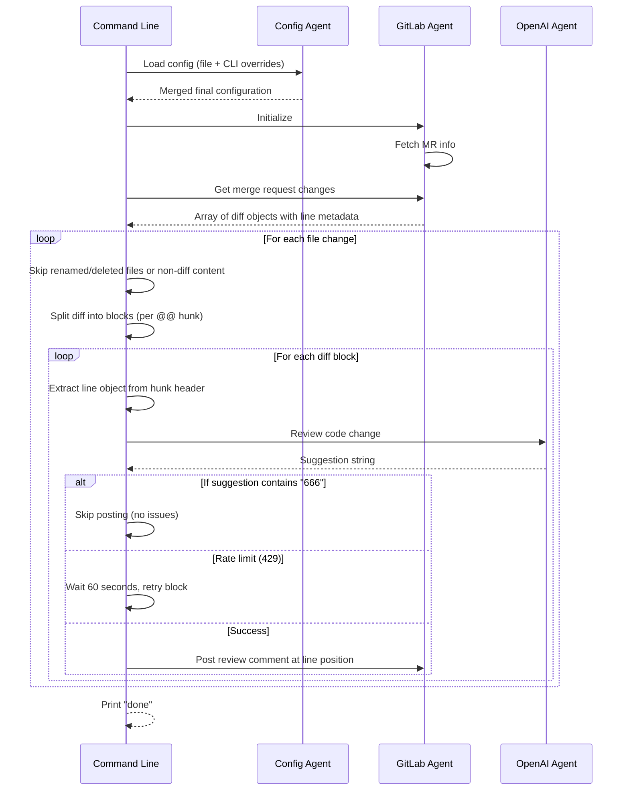

# AI Code Reviewer - Agents Architecture Analysis

## Project Overview

`@kiol/ai-code-reviewer` is a GitLab Merge Request code review tool that leverages OpenAI-compatible APIs to provide automated, intelligent code reviews. The system integrates with GitLab's API to fetch merge request changes and uses large language models (LLMs) to analyze code diffs, providing constructive feedback in Chinese.

**Key Features:**
- Supports private GitLab deployments via configurable API URLs
- Compatible with any OpenAI-compatible LLM provider
- Load balancing support for multiple API keys
- Automatic rate-limit handling with retry logic
- Comments are posted directly to specific code locations in GitLab MR discussions
- Configurable prompts for customized review behavior

---

## Agent Architecture

The system is composed of three primary "agents" or modules that work together:

### 1. Configuration Agent (`src/config.ts`)

**Responsibility:** Manages all configuration loading, parsing, and defaults.

**Key Components:**
- `parseTOML()`: Custom TOML parser supporting basic types, multi-line strings (triple quotes), and nested sections
- `loadConfig()`: Orchestrates config loading with fallback priority:
  1. User-specified config file path
  2. `ai-code-reviewer.config.toml` in current working directory
  3. `ai-code-reviewer.config.json` in current working directory
  4. Built-in `defaultConfig` if no file found
- `processRawConfig()`: Validates and structures raw config data into typed objects

**Data Types:**
```typescript
interface Config {
  gitlab: {
    apiUrl: string;
    accessToken: string;
    projectId: number;
    mergeRequestId: string;
  };
  openai: {
    apiUrl: string;
    accessToken: string;
    model: string;
    organizationId?: string;
    temperature: number;
    stream: boolean;
  };
  prompts: {
    systemContent: string;
    suggestContent: string;
    fullContent: string;
  };
}
```

**Default Values:**
- GitLab API URL: `https://gitlab.com/api/v4`
- OpenAI Model: `gpt-3.5-turbo`
- Temperature: `0` (deterministic responses)
- Prompts include a system role for expert code review and user prompts focused on bug detection, performance issues, and optimization suggestions in Chinese

---

### 2. GitLab Integration Agent (`src/gitlab.ts`)

**Responsibility:** Interfaces with the GitLab REST API to fetch merge request details, diffs, and post review comments.

**Key Components:**
- **Constructor**: Initializes an Axios client with:
  - Base URL from config
  - `Private-Token` header for authentication
- **`init()`**: Fetches merge request info (source branch, diff refs) on startup
- **`getMergeRequestInfo()`**: Retrieves MR metadata including `diff_refs` (base_sha, head_sha, start_sha)
- **`getMergeRequestChanges()`**: Fetches all file diffs in the MR and annotates each with `old_line` and `new_line` derived from the last hunk header (`parseLastDiff()`)
- **`getFileContent(filePath)`**: Retrieves raw file content for context (not currently used in main flow)
- **`addReviewComment(lineObj, change, suggestion)`**: Posts a comment to the GitLab MR discussion API at `/merge_requests/{id}/discussions` with position metadata

**Key Utility - `parseLastDiff()`:**
Extracts line numbers from the last diff hunk header (`@@ ... @@`) to determine where comments should be anchored in the file. Returns `{ old_line, new_line }`.

**API Endpoints Used:**
- `GET /projects/{id}/merge_requests/{mr_id}` - MR info
- `GET /projects/{id}/merge_requests/{mr_id}/diffs` - All diffs
- `POST /projects/{id}/merge_requests/{mr_id}/discussions` - Post comments

---

### 3. OpenAI Integration Agent (`src/openai.ts`)

**Responsibility:** Sends code diff chunks to an LLM for review and returns feedback.

**Key Components:**
- **Constructor**: Initializes Axios client with:
  - Base URL from config
  - Optional `OpenAI-Organization` header (for enterprise accounts)
  - Multiple API keys support via comma-separated string, with round-robin load balancing
- **`reviewCodeChange(change)`**: Sends a code diff chunk to the LLM and returns the review result

**API Call Structure:**
```typescript
{
  model: "gpt-3.5-turbo" | custom,
  temperature: 0 (default),
  stream: false,
  messages: [
    { role: "system", content: config.prompts.systemContent },
    { role: "user", content: config.prompts.suggestContent },
    { role: "user", content: <diff_chunk> }
  ]
}
```

**Endpoints:**
- `POST /v1/chat/completions` - Standard OpenAI-compatible chat completion endpoint

**Load Balancing:**
Multiple API keys are rotated using a simple counter (`accessTokenIndex`) to distribute requests across keys.

---

## Orchestrator Agent (`src/index.ts`)

**Responsibility:** Main entry point that coordinates all agents and drives the review workflow.

**Execution Flow:**



**Key Logic Details:**

1. **Config Merging:** CLI arguments override config file values with this precedence:
   - `gitlab.apiUrl`, `gitlab.accessToken`, `projectId`, `mergeRequestId`
   - `openai.apiUrl`, `openai.accessToken`, `model`, `organizationId`, `temperature`, `stream`
   - `prompts.*` (always from config file, no CLI override)

2. **Diff Chunking:** The full diff for a file is split by the regex `(?=@@\s-\d+(?:,\d+)?\s+\d+(?:,\d+)?\s@@)` to isolate each hunk header. This creates blocks that can be reviewed independently.

3. **Line Position Mapping:** Each diff block's hunk header (`@@ -old_start,old_len +new_start,new_len @@`) is parsed by `getLineObj()` to determine which line number the comment should anchor to in GitLab.

4. **Rate Limit Handling:** If OpenAI returns HTTP 429 (Too Many Requests), the block is pushed back onto the queue and processing pauses for 60 seconds before retrying.

5. **Silent Skip:** Suggestions containing `"666"` are treated as "no issues found" and no comment is posted to GitLab.

---

## Utility Agent (`src/utils.ts`)

**Responsibility:** Shared helpers used across the system.

**Functions:**
- `delay(time)`: Creates a Promise-based timeout (used for rate-limit backoff)
- `getDiffBlocks(diff)`: Splits a git diff string into individual hunk blocks using regex lookahead
- `getLineObj(matches, item)`: Constructs `{ new_line?, old_line? }` object from matched hunk header groups and the last line of the diff block

**Prompt Objects:**
- `systemContent`, `suggestContent`, `fullContent`: Loaded from config at module initialization time. These are used when constructing LLM API requests in `openai.ts`.

**Note:** The utility agent loads configuration eagerly via `loadConfig()` at import time, which means the config is cached for the entire process lifecycle. This is acceptable since the CLI runs once per invocation.

---

### 4. Core Review Service (`src/service/CodeReviewService.ts`) **[重构后新增]**

**Responsibility:** Encapsulates the core review logic to eliminate code duplication between CLI and Web modes.

**Key Components:**
- **`reviewMergeRequest(projectId, mergeRequestId)`**: Orchestrates the entire review process:
  - Creates GitLab client with dynamic project/MR parameters
  - Fetches all file diffs in the MR
  - Iterates through each file, splitting diff into blocks
  - For each block, calls OpenAI for review and posts comments if needed
  - Handles rate limiting (429) with automatic retry after 60 seconds
  - Returns a `ReviewSummary` object with statistics

**Data Types:**
```typescript
interface ReviewSummary {
  success: boolean;
  filesReviewed: FileReviewResult[];
  totalCommentsPosted: number;
  totalErrors: number;
  durationMs: number;
}

interface FileReviewResult {
  filePath: string;
  commentsPosted: number;
  skipped: boolean;
  errors: string[];
}
```

**Benefits:**
- Single source of truth for review logic
- Reusable by both CLI and Web service
- Comprehensive error tracking and reporting

---

### 5. GitLab Hook Service (`src/service/GitlabHookService.ts`) **[Web 服务模块]**

**Responsibility:** Processes GitLab webhook events related to merge requests, specifically detecting when an assignee is first assigned to trigger code review.

**Key Components:**
- **`GitlabMergeRequestEventData`**: TypeScript interface for GitLab's MR webhook payload
- **`handleWebhook(body)`**: Main handler that:
  - Validates the event type (must be `merge_request`)
  - Detects if this is an "assign" event using `detectAction()` logic
  - Checks MR state is "opened" and has assignee(s)
  - Triggers code review via `CodeReviewService`
- **`detectAction(event)`**: Heuristics to determine if this is the first time an assignee was set:
  - Checks `changes.assignees` for presence in webhook payload
  - Compares previous vs current state of assignees array
  - Fallbacks for different GitLab webhook format variations

**GitLab Webhook Events Handled:**
- `merge_request` events with `object_attributes.assigns` changing from empty to non-empty

---

### 6. Web Server (`src/web/index.ts`) **[Web 服务模块]**

**Responsibility:** Provides a lightweight Express.js HTTP server that listens for GitLab MR webhook events on port 8080 (configurable).

**Key Components:**
- **`WebServer` class**: Encapsulates the entire web service:
  - Constructor sets up Express middleware and routes
  - `setupMiddleware()`: Configures JSON parsing, CORS, logging, error handling
  - `setupRoutes()`: Defines two endpoints:
    - `GET /health`: Health check returning server status
    - `POST /webhooks/merge-request`: Webhook receiver for GitLab events
- **`startServer(configPath?)`**: Factory function that creates and starts the server with optional config file path

**Security:**
- Secret token validation via `x-gitlab-token` header (optional but recommended)
- Configurable secret in `[webhook]` section of config file

**Error Handling:**
- Always returns 200 status to prevent GitLab from retrying/failing the webhook
- Detailed error messages in response body for debugging

---

### 7. CLI Entry Point (`src/index.ts`) **[重构后]**

**Responsibility:** Provides a unified command-line interface with subcommands for different usage modes.

**Key Components:**
- **'review' subcommand**: Runs a one-off code review (original behavior, now using `CodeReviewService`):
  - Required options: `-p --project-id`, `-r --merge-request-id`
  - Optional CLI overrides for all config values
  - Prints summary of review results
  
- **'web' subcommand**: Starts the webhook listener server:
  - Optional CLI override for port (`-w --port`)
  - Optional CLI overrides for API keys and URLs
  
- **Legacy behavior**: If no subcommand provided, shows help message

**Command Examples:**
```bash
# Run one-off review via CLI
ai-code-reviewer review -p 12345 -r 8 -t "GITLAB_TOKEN" -a "OPENAI_KEY"

# Start webhook listener server
ai-code-reviewer web -w 9000

# Use config file with overrides
ai-code-reviewer review -c /path/to/config.toml -p 12345 -r 8
```

---

## Data Flow Summary

### CLI Mode (One-off Review)
```
┌─────────────┐     ┌──────────────┐     ┌─────────────┐
│  Config      │────▶│   CLI        │◀────│  GitLab API │
│  Agent       │     │  (review cmd)│     └─────────────┘
└─────────────┘     │              │            │
                    │  ┌───────────▼──────────┐ │
                    │  │   CodeReviewService  │ │
                    │  │  - fetchChanges()    │ │
                    │  │  - reviewDiff()      │ │
                    │  │  - postComment()     │ │
                    │  └───────────┬──────────┘ │
                    └──────────────┼────────────┘
                                   │
                    ┌──────────────▼────────────┐
                    │   OpenAI Agent            │◀── LLM API
                    │  - reviewCodeChange()     │    (OpenAI-compatible)
                    └───────────────────────────┘
```

### Web Server Mode (Webhook Listener)
```
┌──────────────┐     ┌─────────────────┐     ┌─────────────┐
│  GitLab      │────▶│   Web Server    │◀────│  Config     │
│  Webhook     │     │  (webhook cmd)  │     │  Agent      │
└──────────────┘     │                 │     └─────────────┘
                     │  ┌────────────┐ │
                     │  │ Validate   │ │
                     │  │ & Route to │ │
                     │  │ Hook       │ │
                     │  └─────┬──────┘ │
                     │        │        │
                     │  ┌────▼────────┐│
                     │  │ CodeReview  ││
                     │  │ Service     ││
                     │  └─────┬───────┘│
                     └────────┼────────┘
                              │
                    ┌─────────▼──────────┐
                    │ GitLab API         │◀── MR Changes
                    │ & OpenAI Agent     │▶── Review Comments
                    └────────────────────┘
```

---

## Configuration Files

### Example Config (`ai-code-reviewer.config.example.toml`)
Shows how to set up all sections including custom prompts with multi-line strings.

### Active Config (`ai-code-reviewer.config.toml`)
Current production config with:
- Empty API tokens (to be filled in)
- Chinese-focused review prompts emphasizing deep analysis of bugs, concurrency issues, memory leaks, and design problems
- Strict rules: ignore syntax/formatting issues, only report confirmed vulnerabilities, reply `666` for clean code

---

## Webhook Setup Guide

To configure GitLab to send MR webhook events to your server:

1. **Deploy the web service** on a publicly accessible URL (e.g., `https://your-server.com`)
2. **Get your secret token** from config file or set via `-w` option
3. **Add webhook in GitLab**:
   - Navigate to Project → Settings → Webhooks
   - URL: `https://your-server.com/webhooks/merge-request`
   - Secret Token: (from your config)
   - Trigger: Check "Merge request events" only
4. **Test the webhook** using GitLab's "Test" button

The server will only process MR events when an assignee is first assigned to the merge request, preventing duplicate reviews.

---

## CI/CD Integration Example

For CLI mode (one-off review in CI):

```yaml
Code Review:
  stage: merge-request
  image: node:latest
  script:
    - npm i @kiol/ai-code-reviewer -g
    - ai-code-reviewer review -t "$GITLAB_TOKEN" -a "$CHATGPT_KEY" \
        -p "$CI_MERGE_REQUEST_PROJECT_ID" \
        -r "$CI_MERGE_REQUEST_IID"
  only:
    - merge_requests
```

For webhook mode (recommended for production):

1. Deploy the web service as a separate container/service
2. Configure GitLab webhook to point to your server
3. No CI script needed – reviews are triggered automatically when MRs are assigned

---

## CI/CD Integration Example (Legacy)

The old README example used direct CLI invocation in CI:

```yaml
# DEPRECATED - Use new format above
Code Review:
  stage: merge-request
  image: node:latest
  script:
    - npm i @kiol/ai-code-reviewer -g
    - ai-code-reviewer -t "$GITLAB_TOKEN" -a "$CHATGPT_KEY" \
        -p "$CI_MERGE_REQUEST_PROJECT_ID" \
        -r "$CI_MERGE_REQUEST_IID"
  only:
    - merge_requests
```

This ran the tool as a global CLI package during CI, automatically reviewing every merge request.

---

## Error Handling

| Scenario | Behavior |
|----------|----------|
| Config file not found | Uses `defaultConfig` values |
| Invalid config file syntax | Logs warning, tries next config path or falls back to defaults |
| GitLab init fails | Catches error, continues execution (no MR info fetched) |
| Get changes fails | Catches error, logs message, exits without reviewing |
| OpenAI 429 Rate Limit | Waits 60 seconds, retries the same diff block |
| Other OpenAI errors | Logs error and throws up to orchestrator |

---

## Dependencies

### Production Dependencies

```json
{
  "axios": "^1.4.0",        // HTTP client for GitLab & OpenAI APIs
  "commander": "^10.0.1",   // CLI argument parsing
  "express": "^4.18.2",     // Web server framework (new)
  "cors": "^2.8.5"          // CORS middleware for web server (new)
}
```

### Type Definitions

```json
{
  "@types/node": "^20.2.1",       // Node.js types
  "@types/express": "^4.17.17",   // Express.js types (new)
  "@types/cors": "^2.8.13"        // CORS middleware types (new)
}
```

### Build Tooling

- `typescript`: ^5.0.4 - TypeScript compiler and tooling

---

## Project Structure

```
ai-code-reviewer/
├── bin/
│   └── index.js            # CLI entry point (node shebang)
├── lib/                    # Compiled JS output (tsc)
│   ├── config.js
│   ├── gitlab.js
│   ├── openai.js
│   ├── utils.js
│   ├── index.js            # CLI with subcommands
│   ├── service/            # Service layer (new)
│   │   ├── CodeReviewService.js    # Core review logic
│   │   └── GitlabHookService.js    # Webhook event processor
│   └── web/                # Web server module (new)
│       └── index.js        # Express webhook listener
├── src/                    # TypeScript source files
│   ├── config.ts           # Configuration agent
│   ├── gitlab.ts           # GitLab integration agent
│   ├── openai.ts           # OpenAI integration agent
│   ├── utils.ts            # Shared utilities & prompts
│   ├── index.ts            # CLI with subcommands (review/web)
│   ├── service/            # Service layer (new)
│   │   ├── CodeReviewService.ts  # Core review logic
│   │   └── GitlabHookService.ts  # Webhook event processor
│   └── web/                # Web server module (new)
│       └── index.ts        # Express webhook listener
├── docs/
│   └── agents.md           # This file (architecture analysis)
├── ai-code-reviewer.config.toml      # Active config
├── ai-code-reviewer.config.example.toml  # Example config template
├── package.json            # NPM manifest
├── tsconfig.json           # TypeScript config
└── README.md               # User documentation
```

### Configuration Sections

The `[webhook]` section has been added to the TOML configuration:

```toml
[webhook]
port = 8080                  # Port to listen on (default)
secretToken = ""             # Secret for webhook authentication (optional)
```

These settings are loaded by `config.ts` and passed to the `WebServer` constructor.

---

## Extensibility Notes

### Architecture Improvements (v0.1.2+)

1. **Unified Review Logic**: The new `CodeReviewService` eliminates code duplication and makes the review process reusable across CLI and web modes.

2. **Webhook-Driven Mode**: Instead of running reviews on every MR update, the webhook mode triggers reviews only when assignees are assigned – more efficient and user-friendly.

3. **Modular Design**: Separation of concerns:
   - `service/`: Business logic (review orchestration)
   - `web/`: HTTP interface (Express server)
   - `gitlab.ts` / `openai.ts`: External API integrations
   - `config.ts`: Configuration management

### Future Extensions

1. **Additional LLM Providers**: The `openai.ts` agent only requires an OpenAI-compatible `/v1/chat/completions` endpoint. Any provider supporting this API shape (e.g., vLLM, Ollama with plugins, Azure OpenAI) can be used by setting the correct `apiUrl`.

2. **GitHub Support**: Supporting GitHub PRs would require a new `github.ts` integration module following the same pattern as `gitlab.ts`, plus updating the webhook handler for GitHub's event format.

3. **Self-Hosted GitLab/GitHub**: Both agents already support self-hosted instances via configurable API URLs in the `[gitlab]` section.

4. **Prompt Customization**: All prompts are externalized into config, allowing different review personas or focus areas per project without code changes.

5. **Stream Support**: The `openai.stream` config flag is passed through but the current implementation only handles non-streaming responses. Streaming support would need additional parsing logic in `openai.ts`.

6. **Queue/Background Processing**: For large MRs with many files, consider adding a job queue (e.g., BullMQ) to process reviews asynchronously rather than blocking webhook requests.

7. **Web Dashboard**: Add a simple UI for monitoring review status, viewing history, and managing configurations without command-line access.

### Security Considerations

1. **Secret Token Validation**: Always configure `secretToken` in production to verify incoming webhooks from GitLab
2. **HTTPS Required**: Webhook endpoints should use HTTPS to protect tokens and MR data in transit
3. **Rate Limiting**: Consider adding rate limiting middleware to the Express server to prevent abuse
4. **API Key Rotation**: The existing round-robin API key support helps distribute load, but consider implementing automatic key rotation for production deployments